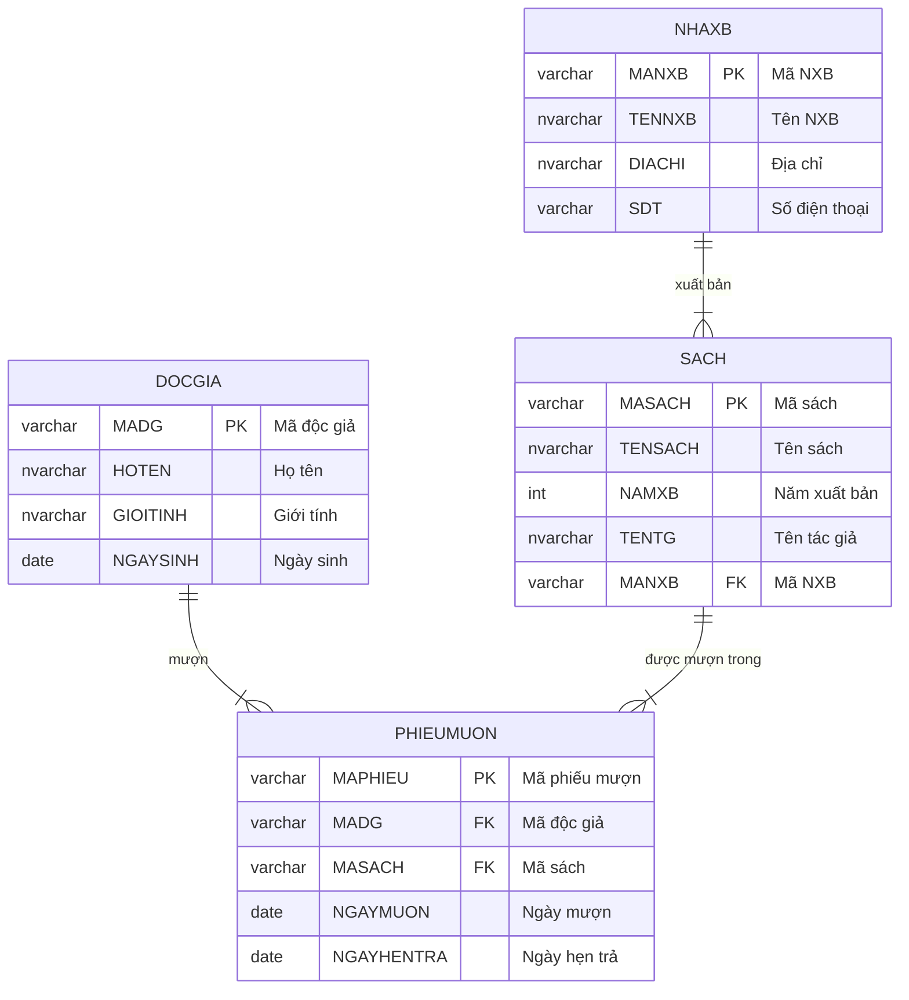

```mermaid
erDiagram
    NHAXB ||--|{ SACH : "xuất bản"
    DOCGIA ||--|{ PHIEUMUON : "mượn"
    SACH ||--|{ PHIEUMUON : "được mượn trong"
    
    NHAXB {
        varchar MANXB PK "Mã NXB"
        nvarchar TENNXB "Tên NXB"
        nvarchar DIACHI "Địa chỉ"
        varchar SDT "Số điện thoại"
    }
    
    DOCGIA {
        varchar MADG PK "Mã độc giả"
        nvarchar HOTEN "Họ tên"
        nvarchar GIOITINH "Giới tính"
        date NGAYSINH "Ngày sinh"
    }
    
    SACH {
        varchar MASACH PK "Mã sách"
        nvarchar TENSACH "Tên sách"
        int NAMXB "Năm xuất bản"
        nvarchar TENTG "Tên tác giả"
        varchar MANXB FK "Mã NXB"
    }
    
    PHIEUMUON {
        varchar MAPHIEU PK "Mã phiếu mượn"
        varchar MADG FK "Mã độc giả"
        varchar MASACH FK "Mã sách"
        date NGAYMUON "Ngày mượn"
        date NGAYHENTRA "Ngày hẹn trả"
    }
```
