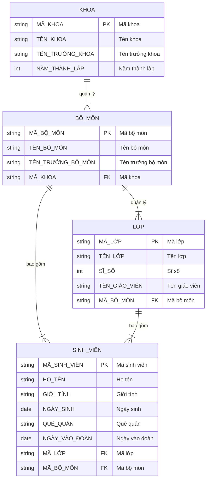

```mermaid
erDiagram
    KHOA ||--|{ BỘ_MÔN : "quản lý"
    BỘ_MÔN ||--|{ SINH_VIÊN : "bao gồm"
    LỚP ||--|{ SINH_VIÊN : "bao gồm"
    BỘ_MÔN ||--|{ LỚP : "quản lý"
    
    KHOA {
        string MÃ_KHOA PK "Mã khoa"
        string TÊN_KHOA "Tên khoa"
        string TÊN_TRƯỞNG_KHOA "Tên trưởng khoa"
        int NĂM_THÀNH_LẬP "Năm thành lập"
    }
    
    BỘ_MÔN {
        string MÃ_BỘ_MÔN PK "Mã bộ môn"
        string TÊN_BỘ_MÔN "Tên bộ môn"
        string TÊN_TRƯỞNG_BỘ_MÔN "Tên trưởng bộ môn"
        string MÃ_KHOA FK "Mã khoa"
    }
    
    LỚP {
        string MÃ_LỚP PK "Mã lớp"
        string TÊN_LỚP "Tên lớp"
        int SĨ_SỐ "Sĩ số"
        string TÊN_GIÁO_VIÊN "Tên giáo viên"
        string MÃ_BỘ_MÔN FK "Mã bộ môn"
    }
    
    SINH_VIÊN {
        string MÃ_SINH_VIÊN PK "Mã sinh viên"
        string HỌ_TÊN "Họ tên"
        string GIỚI_TÍNH "Giới tính"
        date NGÀY_SINH "Ngày sinh"
        string QUÊ_QUÁN "Quê quán"
        date NGÀY_VÀO_ĐOÀN "Ngày vào đoàn"
        string MÃ_LỚP FK "Mã lớp"
        string MÃ_BỘ_MÔN FK "Mã bộ môn"
    }
```
